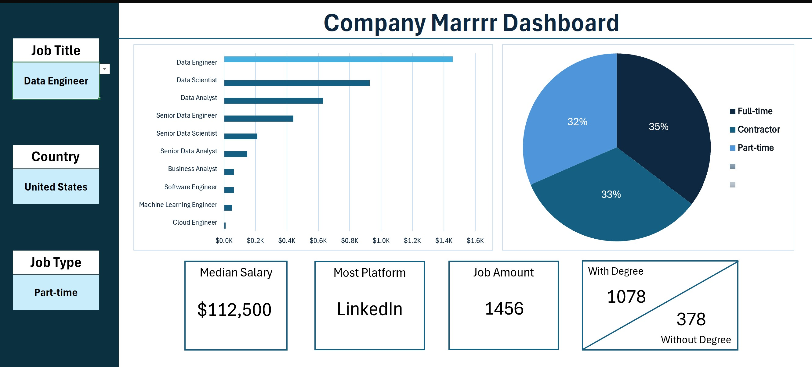
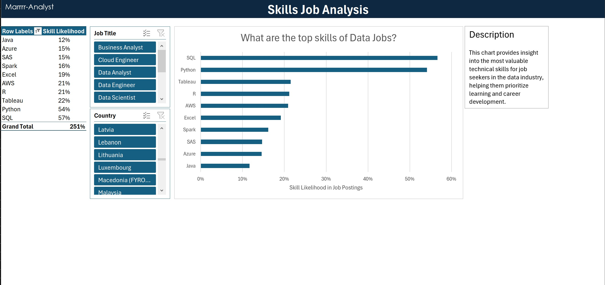
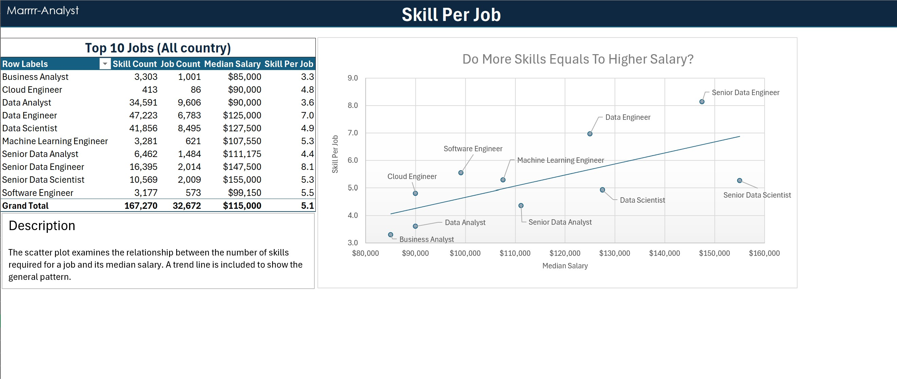
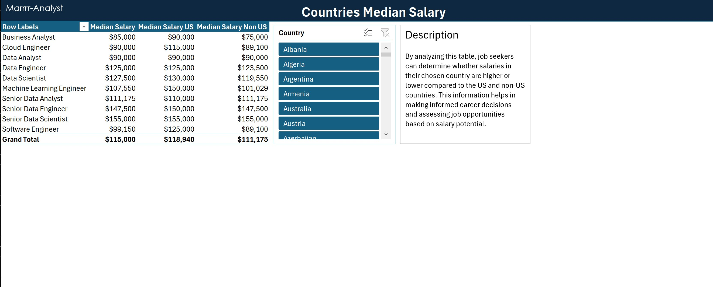
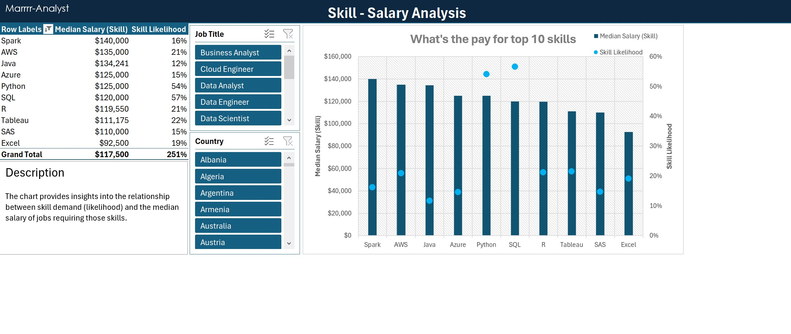

# Marrrrr Project
These projects highlight my expertise in Excel, particularly in data analysis, visualization, and advanced data manipulation.

# Project 1: Dashboard Project
I developed an interactive salary dashboard that allows users to analyze median salaries and job availability based on job titles, job types, and locations. 

  
*This image shows the dashboard created using Excel.*

The dashboard lets you change three things: Job Title, Country, and Job Type. Based on what you pick, it shows the median salary, where the jobs are posted, how many jobs there are, and whether a degree is required.

This project demonstrates my ability to structure and visualize data effectively, making insights easily accessible.

# Project 2: Analysis Project
This project focuses on analyzing data-related jobs across all countries, including required skills and the likelihood of skills appearing in job postings.

  
*This worksheet showcases the analysis of top skills in data jobs.*

  
*This worksheet showcases the analysis of the relationship between the number of skills and the highest salary for data jobs.*

  
*This worksheet showcases the analysis of salaries for data jobs based on countries. It also compares the salaries from the selected country with those in the US.*

  
*This worksheet showcases the relationship between skill demand and the median salary of data jobs requiring those skills.*

It showcases my proficiency in data cleaning and transformation using **Power Pivot** and **Power Query**, ensuring well-structured and meaningful insights.

Together, these projects demonstrate my ability to handle real-world datasets, apply data analysis techniques, and create actionable insights using Excel. It is inspired by Luke Barousse, a well-known educator in Excel for data analysts.